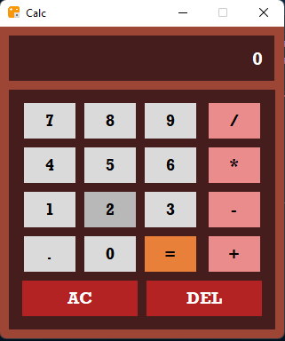

# Calculator
A Calculator developed using Python framework Tkinter. It can perform operations:
- Addition(+)
- Subtraction(-)
- Multiplication(*)
- Division(/)
- Delete/All Clear(DEL/AC)

### How To Use ###
1.Enter the first number using the numeric keypad.

2.Select the desired operation (+, -, ×, ÷) by clicking the corresponding button.

3.Enter the second number.

4.Click the equals (=) button to see the result of the operation.

## Sample ##

